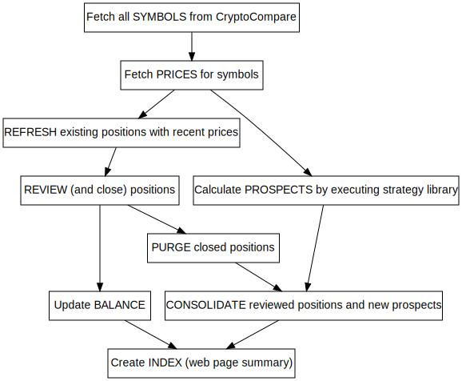

[](https://travis-ci.org/deanturpin/handt)

**Have A Nice Day Trader** is an algorithmic trading platform. Prices are
requested for a list of currency symbols, a library of strategies is run over
the prices and a web page summary of strategy performance is generated every
minute. The positions are (notionally) closed if they exceed a sell threshold or
expire after 24 hours.



Build "update" to fetch fresh prices and symbols.
```bash
make update
```

# C++
The C++ is built with a C++14 compliant compiler (gcc, clang). The code confirms
to LLVM's coding standard by virtue of periodic runs of ```clang-format``` over
the source. To speed up development the bash script ```bin/waitandcompile.sh```
can be used to compile and run C++ code as it is saved.

```bash
$ bin/waitandcompile.sh index.cpp 
Wait for index.cpp
Using standard c++14
```

# Web server
```cron``` is used to schedule builds on a Linux web server. The project is
periodically pulled from GitHub, compiled, run and if successful the results are
copied into the web root. Modules are unit tested with each compilation and a
code coverage tool can be run on demand. Compilation errors discovered on the
server are reported immediately by email.

```bash
*/1 * * * * cd ~/handt && nice make CXX=g++ --silent gitpull update && cp -u index.html ~/public_html/
```

The web page is created from an [HTML template](include/index.html). The
template contains keywords which are substituted for current data.

```html
<h1>Have A Nice Day Trader <small>DATE</small></h1>
```

# Exchanges
Intuitively it feels that requesting prices more often will make the software
more responsive to market changes. But Coinbase and CryptoCompare actually don't
publish updates more often than once per minute. CryptoCompare also has API
request rate limiting but in practice only 60 coins can be processed per minute
to ensure we don't clash with the next cron job.

## Currency viability
Before running the strategies coins are subjected to a preflight check to ensure
the currency has some activity.

# Strategy window during back-testing
*Any* strategy that triggered a year ago on BTC would have succeeded by now. So
we must consider how far into the future we are prepared to go. For example:
should we expect a return after one day from a decision based on a week's worth
of prices?

# Results from previous version
```
COINBASE ONLY           POS     min     mean    max
20.0_old_above_new      3       107     108     110
10.0_stepping_down      1       108     108     108
20.0_red_snapper        1       107     107     107
```
BCH     20.0_old_above_new      maturity 1335.4100000000 1432.1200000000 1526041303 false
BCH     10.0_old_above_new      maturity 1310.2800000000 1392.0366666667 1526113002 false
BCH     5.00_stepping_down      maturity 1310.2800000000 1392.0366666667 1526113002 false
BCH     10.0_stepping_down      maturity 1365.4300000000 1478.4700000000 1526042680 false
BCH     20.0_old_above_new      maturity 1344.4800000000 1478.4700000000 1526071562 false
BCH     5.00_flicking_down      maturity 1362.6300000000 1478.4700000000 1526083185 false
BCH     5.00_old_above_new      maturity 1376.7500000000 1478.4700000000 1526088291 false
BCH     5.00_rolling_average2   maturity 1392.0400000000 1478.4700000000 1526120502 false
BCH     10.0_old_above_new      maturity 1392.0400000000 1478.4700000000 1526120502 false
BCH     5.00_roll_average4      maturity 1392.0400000000 1478.4700000000 1526120502 false
BCH     5.00_stepping_down      maturity 1392.0400000000 1478.4700000000 1526120502 false
LTC     5.00_flicking_down      maturity 134.8530000000 143.4900000000 1526102142 false
LTC     5.00_stepping_down      maturity 134.8970000000 143.4900000000 1526112052 false
LTC     10.0_old_above_new      maturity 134.0630000000 143.4900000000 1526112766 false
ETH     5.00_flicking_down      maturity 648.5070000000 687.7866666667 1526113843 false
ETH     5.00_straddler_1        maturity 648.5070000000 687.7866666667 1526113843 false
ETH     5.00_straddler_2        maturity 648.5070000000 687.7866666667 1526113843 false
ETH     10.0_straddler_2        maturity 648.5070000000 687.7866666667 1526113843 false
ETH     20.0_straddler_2        maturity 648.5070000000 687.7866666667 1526113843 false
ETH     30.0_straddler_2        maturity 648.5070000000 687.7866666667 1526113843 false
ETH     5.00_red_snapper        maturity 648.5070000000 687.7866666667 1526113843 false
ETH     5.00_old_above_new      maturity 648.5070000000 687.7866666667 1526113843 false
ETH     10.0_steady_riser       maturity 671.4670000000 717.8133333333 1526160100 false
ETH     30.0_steady_riser       maturity 678.8370000000 720.3033333333 1526174022 false
ETH     5.00_steady_riser       maturity 680.5070000000 724.2266666667 1526155782 false
ETH     20.0_steady_riser       maturity 681.3800000000 724.2266666667 1526165860 false
BCH     5.00_steady_down        maturity 1370.7700000000 1462.4366666667 1526268766 false
BCH     5.00_flicking_down      maturity 1370.7700000000 1462.4366666667 1526268766 false
BCH     5.00_old_above_new      maturity 1379.3500000000 1462.4366666667 1526290722 false
BCH     5.00_steady_riser       maturity 1379.3500000000 1462.4366666667 1526290722 false
BCH     5.00_old_above_new      maturity 1252.1700000000 1334.4233333333 1526441324 false
BCH     5.00_stepping_down      maturity 1247.0000000000 1334.4233333333 1526444022 false
LTC     5.00_flicking_down      maturity 129.3070000000 137.1300000000 1526604520 false
LTC     5.00_old_above_new      maturity 129.3070000000 137.1300000000 1526604520 false
ETH     20.0_red_snapper        maturity 565.6600000000 605.8500000000 1527097903 false
ETH     20.0_old_above_new      maturity 565.6600000000 605.8500000000 1527097903 false
```
