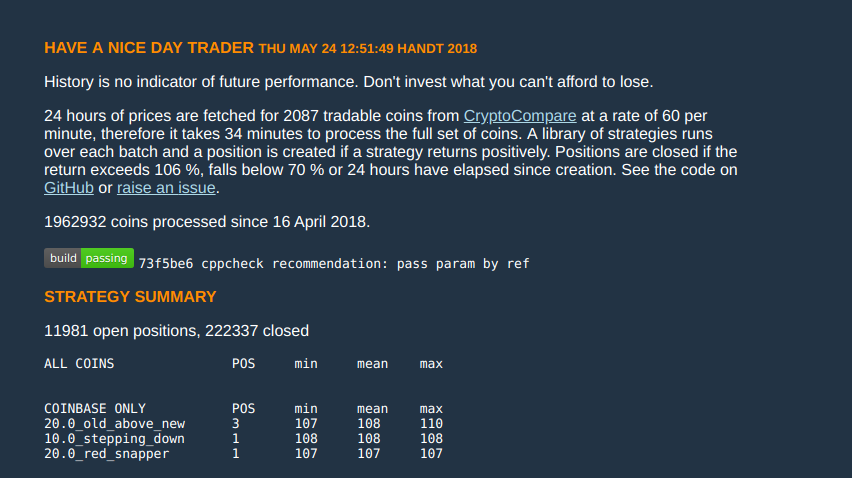

# Build
Clone and build using ```make``` to overwrite ```readme.md``` with the generated
strategy summary. Commmit the update and the web page results can be viewed in
GitHub Pages.

# C++
The C++ is built with a C++14 compliant compiler (gcc, clang). The code confirms
to LLVM's coding standard by running ```clang-format``` as a pre-commit hook.

# Web server
On each commit Travis CI compiles and runs the source and if successful deploys
the (markdown) results back to GitHub in the gh-pages branch. Jekyll then runs
to generate the complete HTML.

# Exchanges
Binance was the chosen exchange as it has a good selection of currencies. But
the prices are fetched via Crytpo Compare so the exchange can be changed without
updating the interface.

# Strategy window size considerations
*Any* strategy that triggered a year ago on BTC would have succeeded by now. So
we must consider how far into the future we are prepared to go look. For
example: should we expect a return after one day from a decision based on a
week's worth of prices?

# Previous version of HANDT
The original version ran once a minute on a web-server. The process modularised
nicely but maintaining state between stages required quite a lot of code. It
also ran only on new data so it took a while to build up confidence in the
strategies. I soon realised it was inefficient to wait for new data to come in
to prove the strategies. Also, a sigificant proportion of the original design
was concerned with saving state between modules/runs, consequently the current
design halved the line count.




## Key results
```
COINBASE ONLY           POS     min     mean    max
20.0_old_above_new      3       107     108     110
10.0_stepping_down      1       108     108     108
20.0_red_snapper        1       107     107     107
```
```
BCH     20.0_old_above_new      maturity 1335.4100000000 1432.1200000000 1526041303 false
BCH     10.0_old_above_new      maturity 1310.2800000000 1392.0366666667 1526113002 false
BCH     5.00_stepping_down      maturity 1310.2800000000 1392.0366666667 1526113002 false
BCH     10.0_stepping_down      maturity 1365.4300000000 1478.4700000000 1526042680 false
BCH     20.0_old_above_new      maturity 1344.4800000000 1478.4700000000 1526071562 false
BCH     5.00_flicking_down      maturity 1362.6300000000 1478.4700000000 1526083185 false
BCH     5.00_old_above_new      maturity 1376.7500000000 1478.4700000000 1526088291 false
BCH     5.00_rolling_average2   maturity 1392.0400000000 1478.4700000000 1526120502 false
BCH     10.0_old_above_new      maturity 1392.0400000000 1478.4700000000 1526120502 false
BCH     5.00_roll_average4      maturity 1392.0400000000 1478.4700000000 1526120502 false
BCH     5.00_stepping_down      maturity 1392.0400000000 1478.4700000000 1526120502 false
LTC     5.00_flicking_down      maturity 134.8530000000 143.4900000000 1526102142 false
LTC     5.00_stepping_down      maturity 134.8970000000 143.4900000000 1526112052 false
LTC     10.0_old_above_new      maturity 134.0630000000 143.4900000000 1526112766 false
ETH     5.00_flicking_down      maturity 648.5070000000 687.7866666667 1526113843 false
ETH     5.00_straddler_1        maturity 648.5070000000 687.7866666667 1526113843 false
ETH     5.00_straddler_2        maturity 648.5070000000 687.7866666667 1526113843 false
ETH     10.0_straddler_2        maturity 648.5070000000 687.7866666667 1526113843 false
ETH     20.0_straddler_2        maturity 648.5070000000 687.7866666667 1526113843 false
ETH     30.0_straddler_2        maturity 648.5070000000 687.7866666667 1526113843 false
ETH     5.00_red_snapper        maturity 648.5070000000 687.7866666667 1526113843 false
ETH     5.00_old_above_new      maturity 648.5070000000 687.7866666667 1526113843 false
ETH     10.0_steady_riser       maturity 671.4670000000 717.8133333333 1526160100 false
ETH     30.0_steady_riser       maturity 678.8370000000 720.3033333333 1526174022 false
ETH     5.00_steady_riser       maturity 680.5070000000 724.2266666667 1526155782 false
ETH     20.0_steady_riser       maturity 681.3800000000 724.2266666667 1526165860 false
BCH     5.00_steady_down        maturity 1370.7700000000 1462.4366666667 1526268766 false
BCH     5.00_flicking_down      maturity 1370.7700000000 1462.4366666667 1526268766 false
BCH     5.00_old_above_new      maturity 1379.3500000000 1462.4366666667 1526290722 false
BCH     5.00_steady_riser       maturity 1379.3500000000 1462.4366666667 1526290722 false
BCH     5.00_old_above_new      maturity 1252.1700000000 1334.4233333333 1526441324 false
BCH     5.00_stepping_down      maturity 1247.0000000000 1334.4233333333 1526444022 false
LTC     5.00_flicking_down      maturity 129.3070000000 137.1300000000 1526604520 false
LTC     5.00_old_above_new      maturity 129.3070000000 137.1300000000 1526604520 false
ETH     20.0_red_snapper        maturity 565.6600000000 605.8500000000 1527097903 false
ETH     20.0_old_above_new      maturity 565.6600000000 605.8500000000 1527097903 false
```
